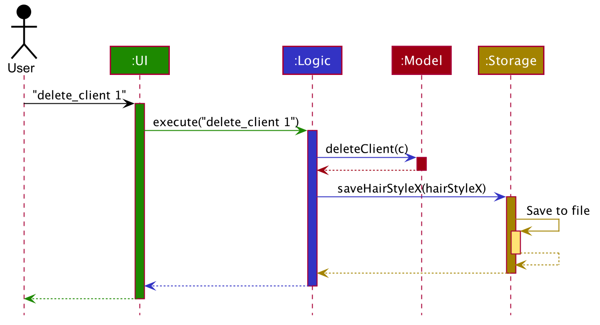
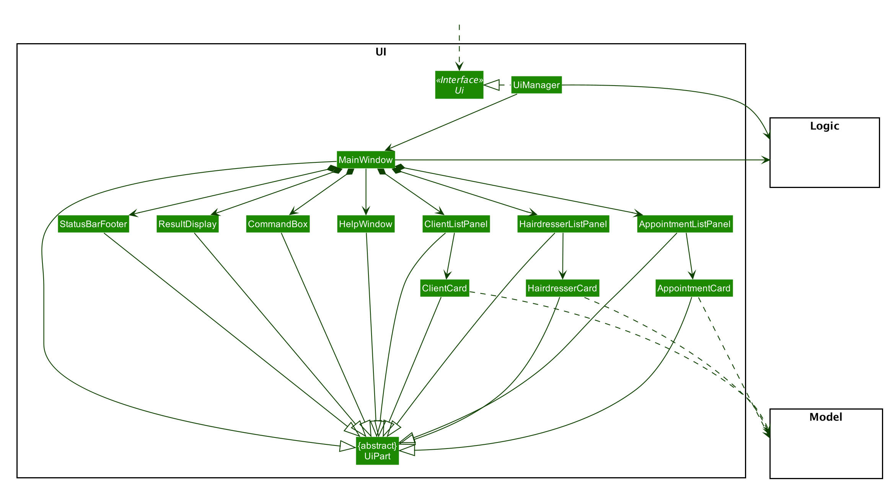
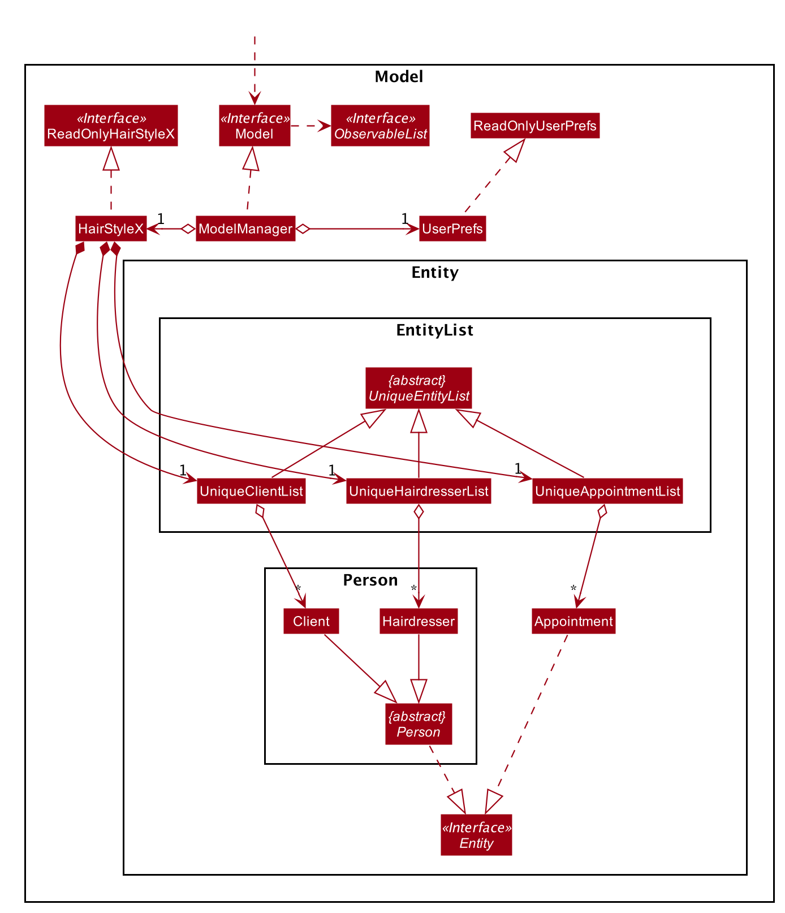
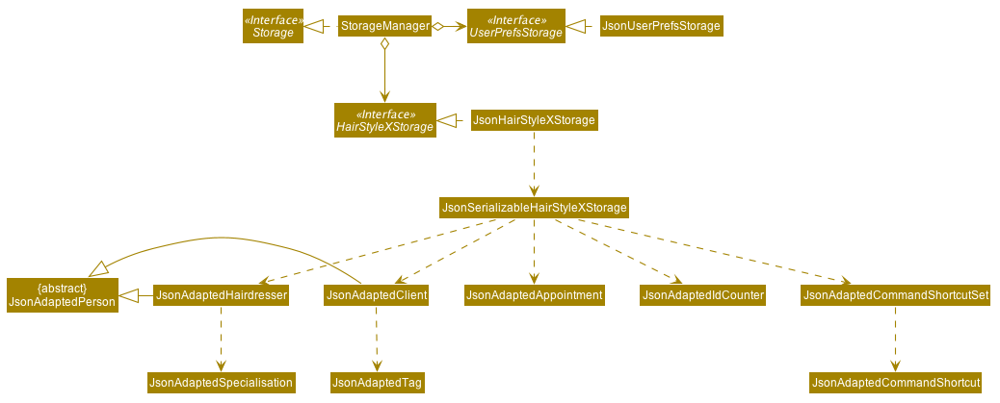
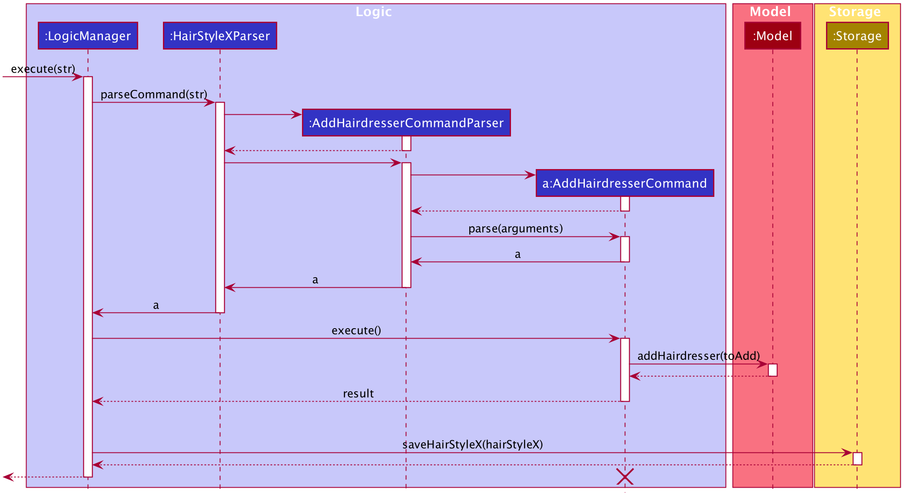
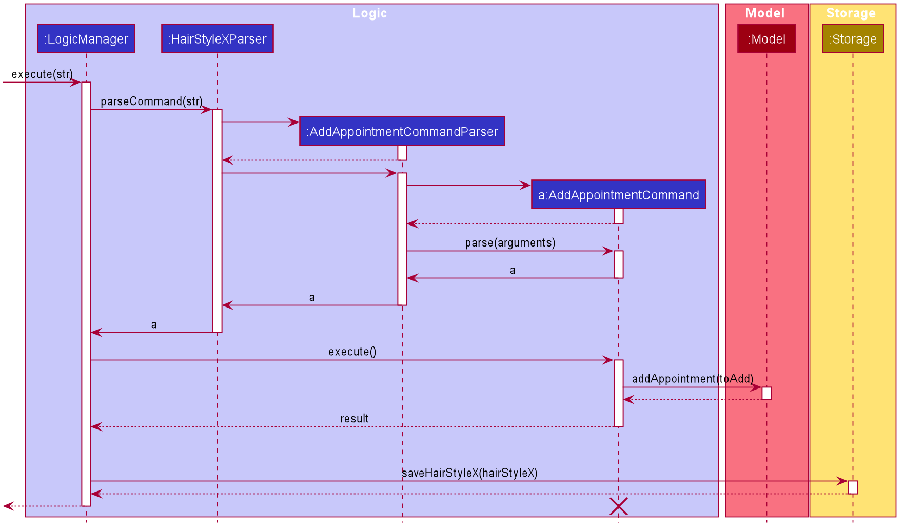
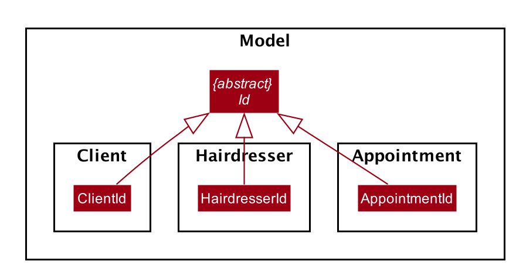
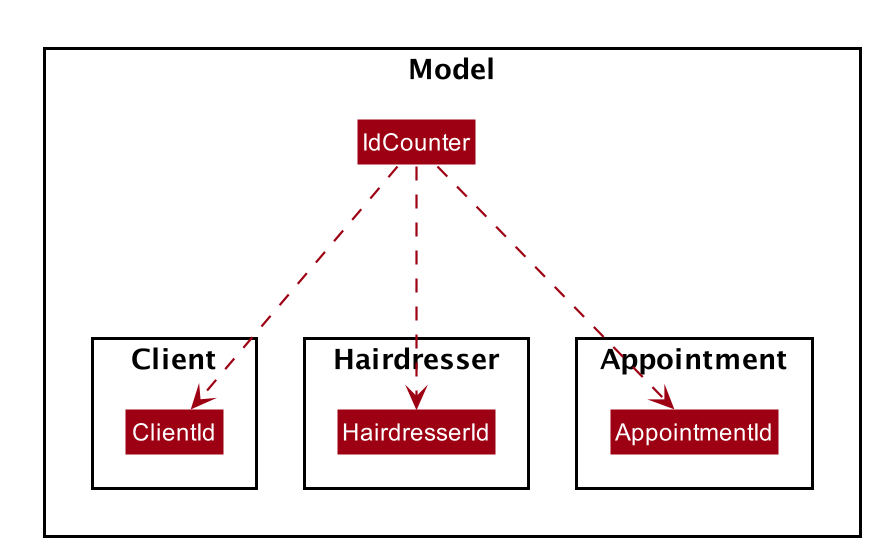
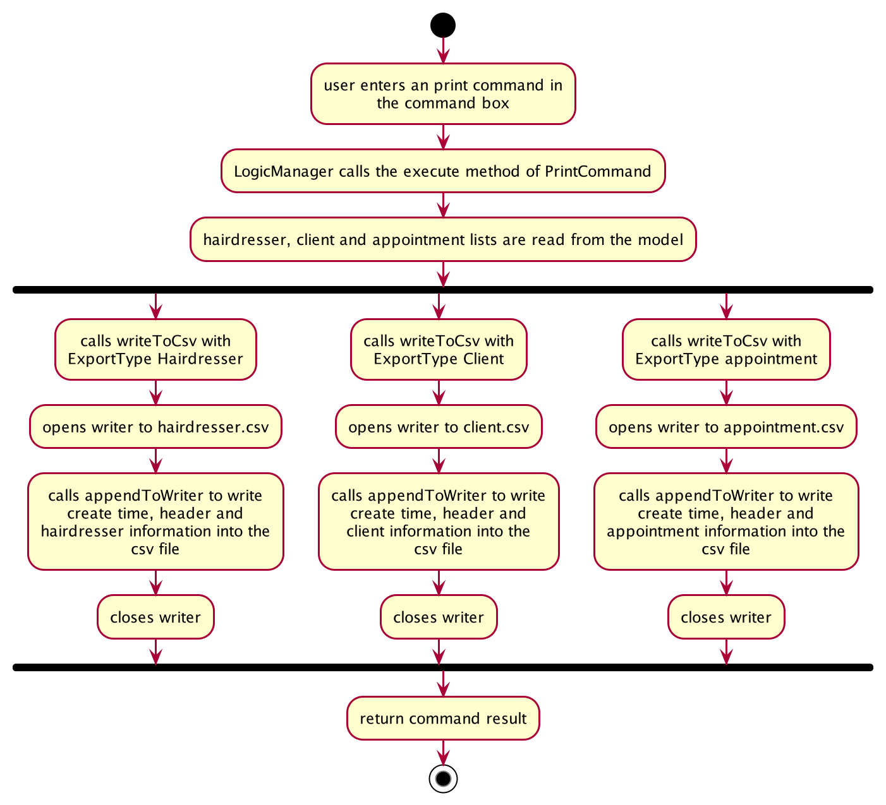

* Table of Contents
{:toc}

--------------------------------------------------------------------------------------------------------------------

## **Setting up, getting started**

Refer to the guide [_Setting up and getting started_](SettingUp.md).

--------------------------------------------------------------------------------------------------------------------

## **Design**

### Architecture

The ***Architecture Diagram*** given above explains the high-level design of the App. Given below is a quick overview of each component.

:bulb: **Tip:** The `.puml` files used to create diagrams in this document can be found in the [diagrams](https://github.com/se-edu/addressbook-level3/tree/master/docs/diagrams/) folder. Refer to the [_PlantUML Tutorial_ at se-edu/guides](https://se-education.org/guides/tutorials/plantUml.html) to learn how to create and edit diagrams.

**`Main`** has two classes called [`Main`](https://github.com/se-edu/addressbook-level3/tree/master/src/main/java/seedu/address/Main.java) and [`MainApp`](https://github.com/se-edu/addressbook-level3/tree/master/src/main/java/seedu/address/MainApp.java). It is responsible for,
* At app launch: Initializes the components in the correct sequence, and connects them up with each other.
* At shut down: Shuts down the components and invokes cleanup methods where necessary.

[**`Commons`**](#common-classes) represents a collection of classes used by multiple other components.

The rest of the App consists of four components.

* [**`UI`**](#ui-component): The UI of the App.
* [**`Logic`**](#logic-component): The command executor.
* [**`Model`**](#model-component): Holds the data of the App in memory.
* [**`Storage`**](#storage-component): Reads data from, and writes data to, the hard disk.

Each of the four components,

* defines its *API* in an `interface` with the same name as the Component.
* exposes its functionality using a concrete `{Component Name}Manager` class (which implements the corresponding API `interface` mentioned in the previous point.

For example, the `Logic` component (see the class diagram given below) defines its API in the `Logic.java` interface and exposes its functionality using the `LogicManager.java` class which implements the `Logic` interface.

**How the architecture components interact with each other**

The *Sequence Diagram* below shows how the components interact with each other for the scenario where the user issues the command `delete_client 1`.

The sections below give more details of each component.

### UI component

**API** :
[`Ui.java`](https://github.com/se-edu/addressbook-level3/tree/master/src/main/java/seedu/address/ui/Ui.java)

The UI consists of a `MainWindow` that is made up of parts e.g.`CommandBox`, `ResultDisplay`, `ClientListPanel`, `StatusBarFooter` etc. All these, including the `MainWindow`, inherit from the abstract `UiPart` class.

The `UI` component uses JavaFx UI framework. The layout of these UI parts are defined in matching `.fxml` files that are in the `src/main/resources/view` folder. For example, the layout of the [`MainWindow`](https://github.com/se-edu/addressbook-level3/tree/master/src/main/java/seedu/address/ui/MainWindow.java) is specified in [`MainWindow.fxml`](https://github.com/se-edu/addressbook-level3/tree/master/src/main/resources/view/MainWindow.fxml)

The `UI` component,

* Executes user commands using the `Logic` component.
* Listens for changes to `Model` data so that the UI can be updated with the modified data.

### Logic component

**API** :
[`Logic.java`](https://github.com/se-edu/addressbook-level3/tree/master/src/main/java/seedu/address/logic/Logic.java)

1. `Logic` uses the `HairStyleXParser` class to parse the user command.
1. This results in a `Command` object which is executed by the `LogicManager`.
1. The command execution can affect the `Model` (e.g. adding a client).
1. The result of the command execution is encapsulated as a `CommandResult` object which is passed back to the `Ui`.
1. In addition, the `CommandResult` object can also instruct the `Ui` to perform certain actions, such as displaying help to the user.

Given below is the Sequence Diagram for interactions within the `Logic` component for the `execute("delete_client 1")` API call.

:information_source: **Note:** The lifeline for `DeleteCommandParser` should end at the destroy marker (X) but due to a limitation of PlantUML, the lifeline reaches the end of diagram.

### Model component

**API** : [`Model.java`](https://github.com/se-edu/addressbook-level3/tree/master/src/main/java/seedu/address/model/Model.java)

The `Model`,

* stores a `UserPref` object that represents the user’s preferences.
* stores the address book data.
* exposes an unmodifiable `ObservableList<Client>`, `ObservableList<Hairdresser>`, `ObservableList<Appointment>` that can be 'observed' e.g. the UI can be bound to this list so that the UI automatically updates when the data in the list change.
* does not depend on any of the other three components.

:information_source: **Note:** An alternative (arguably, a more OOP) model is given below. It has a `Tag` list in the database, which `Person` references. This allows `HairStyleX` to only require one `Tag` object per unique `Tag`, instead of each `Person` needing their own `Tag` object. 

### Storage component

**API** : [`Storage.java`](https://github.com/se-edu/addressbook-level3/tree/master/src/main/java/seedu/address/storage/Storage.java)

The `Storage` component,
* can save `UserPref` objects in json format and read it back.
* can save the HairStyleX data in json format and read it back.

### Common classes

Classes used by multiple components are in the `seedu.address.commons` package.

--------------------------------------------------------------------------------------------------------------------

## **Implementation**

This section describes some noteworthy details on how certain features are implemented.

### Command Shortcut feature
This feature allows users to define their own shortcuts for commands that make it easier for them to type.
#### Current Implementation

This shows the general structure used to implement the Command Alias.
* `Command Word` - This is an enumeration that corresponds to each command in the application.
* `CommandShortcut` - This is a class which stores the hashset of strings that correspond to a particular word. These strings 
are the command word's shortcuts.
* `CommandShortcutSet` - This is a singleton class which stores all the commandShortcut in the application.
It is responsible for finding the command word associated with a given input string and to validate whether the 
new shortcuts are allowed to be saved into the system.

#### Add Shortcuts
Steps: 
1. User input a command to the system. It is parsed regularly as before, extracting the string.
2. `HairStyleXParser` will pass the string to `CommandShortcutSet` to retrieve the corresponding `CommandWord`.
3. Then, the `CommandWord` is processed as usual.

Steps when adding a new shortcut:
1. User inputs an `add_shortcut` command together with the new shortcut, and the command it is associated with.
2. Upon execution, `CommndShortcutSet` will do validation to check if the validity of the new shortcut. 
3. Finally, `CommandShortcutSet` adds the new shortcut to the `CommandShortcut` it is matched to.

Steps when deleting a new shortcut
1. User inputs an `delete_shortcut` command together with the shortcut to be deleted.
2. Upon execution, `CommndShortcutSet` will check if the shortcut to be deleted exists and find its corresponding `CommandShortcut`. 
3. Finally, `CommandShortcutSet` deletes the shortcut from the `CommandShortcut`.

Steps when listing all shortcuts
1. User inputs an `list_shortcut` command.
2. Upon execution, `CommndShortcutSet` will retrieve the string representation of all its `CommandShortcut` and combine them into one string.
3. Finally, `CommandShortcutSet` returns the string representation of all its shortcuts.

#### Saving the Shortcut

`JsonHairStyleXStorage` saves `CommandShortcutSet` as a `JsonAdapatedCommandShortcutSet` together with its `JsonAdaptedShortcut`.
Upon starting the application,  `JsonHairStyleXStorage` is used to set the singleton `CommandShortcutSet`.

### Hairdresser Management Features

#### Overview of implementation for Hairdresser

* `Hairdresser` - This is an entity class to store information regarding an appointment, such as name, phone, email, gender, title, specialisation.
* `Specialisation` - This is class containing an enum which represents the specialisations of a hairdresser, which includes `Color`, `Perm`, `HairExtension`, `Styling`, `HairConditioning`, `Straightening`, `ScalpTreatment`, `HairLossTreatment`.
* `HairdresserID` - This is a class which represents the unique ID of an appointment.
* `UniqueHairdresserList` - This is a `UniqueEntityList` which represents all hairdressers. It ensures that no duplicates of hairdresser can be added and supports add, update, delete of hairdressers.
* `JsonAdaptedHairdresser` - This class functions as an adapter between Appointment and the Storage layer. It specifies how to convert from an appointment object to a JSON representation and vice versa. It also serves as validation for correct data format when the save file is loaded.
* `AddHairdresserCommandParser` - This class parses a user input string to a `HairdresserCommand` object and performs validation.
* `AddHairdresserCommand` - This contains `execute` method which interact with model to perform the add action.

#### Add Hairdresser Feature

##### Current implementation

The `add_hairdresser` command allows the `LogicManager` to create a new hairdresser and add it to the list of hairdressers. 

The following sequence shows the sequence when the add command is execute by the `LogicManager`:

From the diagram above:

1. `LogicManager`’s `execute` is called when `add_hairdresser` is entered and it calls upon `parseCommand` of `HairStyleXParser` to parse the command.

2. `HairStyleXParser` will initialize `AddHairdresserCommandParser` and invoke the method `parse` to further parse add hairdresser command

3. `parse` will be invoked and passed the parameters of the add hairdresser command.

4. If all the arguments of `add_hairdresser` commands are valid, `AddHairdresserCommand` will be returned to the `LogicManager`

5. `LogicManger` will then call `execute` method of `AddHairdresserCommand`

6. `AddHairdresserCommand` will call `addHairdresser` passing `toAdd` as an argument to `Model` and returns a `result` to the `LogicManager`

7. `LogicManger` will then call `saveHairStyleX` method of `Storage`

8. A `CommandResult` will be returned at the end.

### Appointment feature
(Contributed by Nicholas)
This feature represents an appointment between a hairdresser and a client. An appointment consists of a client and a hairdresser. If one of these persons are deleted, the reference will be replaced with a tombstone value indicating a deleted hairdresser/client. A client can have multiple appointments that do not clash, similarly for hairdressers. An appointment must also have a date, time, and status.

#### Overview of implementation for Appointment

* `Appointment` - This is an entity class to store information regarding an appointment, such as hairdresser, client, hairdresser ID, client ID, date, time and status.
                       
* `FutureAppointment` - This is an entity class which extends Appointment. This class ensures that a newly created appointment is always in the future compared to the system time.
* `AppointmentStatus` - This is an enum which represents the status of an appointment, which can be `active`, `cancelled`, `completed`, or `missed`.
* `AppointmentID` - This is a class which represents the unique ID of an appointment.
* `UniqueAppointmentList` - This is a `UniqueEntityList` which represents all appointments. It implements features including ensuring that no duplicate appointments can be added. It allows for clients or hairdressers to be replaced or deleted, and updates the relevant appointments.
*`JsonAdaptedAppointment` - This class functions as an adapter between Appointment and the Storage layer. It specifies how to convert from an appointment object to a JSON representation and vice versa. It also serves as validation for correct data format when the save file is loaded.

*`AddAppointmentCommandParser` - This class parses a user input string to an AppointmentCommand object. Validation for inputs that do not require access to the model is performed here.                                                                  
*`AddAppointmentCommand` - This is where majority of the logic of the add appointment command is performed, when the `execute` method is called. It will access the model to ensure there is no duplicate appointment before adding the appointment to the model.

####Add Appointment Feature
##### Current implementation

From the diagram above:

1. When the user enters a command string into the command box,`LogicManager`’s `execute` is called when with the string as an argument. This command string is logged, and then passed to `parseCommand` of `HairStyleXParser` which parses the command.

2. If the command string matches the format for an add appointment command, `HairStyleXParser` will initialize an `AddAppointmentCommandParser` and invoke the method `parse` to further parse the command.

3. `parse` of `AddAppointmentCommandParser` will be invoked, and passed the parameters of the add hairdresser command. Here, validation that does not require access to the model is performed, for example, validating the format of hairdresser ID, client ID, date, and time. It ensures that the date/time is valid and is in the future, but does not check whether the hairdresser/client ID corresponds to an actual hairdresser/client (this is validated when the command is executed). 

4. If the command is valid, a new `AddAppointmentCommand` object is created and returned to the `LogicManager`. Otherwise, a `ParseException` may be thrown.

5. `LogicManger` will then call the `execute` method of `AddAppointmentCommand`, with the `model` as an argument. Here, checks are performed, such as verifying if the hairdresser/client ID corresponds to an actual hairdresser/client, and the appointment is checked against existing appointments in the model to ensure that there are no duplicates or clashes. The appointment object is then added to the model.

6. If the command is valid `AddAppointmentCommand` will call `addAppointment` of `Model` with the newly created appointment as an argument, then it will return a `CommandResult`. Otherwise, a `CommandException` may be thrown.

7. `LogicManger` will then call `saveHairStyleX` method of `Storage`. This triggers storing information to non-volatile memory using the Storage layer.

8. The `CommandResult` is returned.

#### Proposed improvements
1. Currently, validation or updating of appointments based on client/hairdresser ID requires iterating through all appointments to check if they involve the relevant client/hairdresser. Hence this process is slow and runs in O(n) time. It can be improved by implementing two `HashMaps` of appointments keyed by `ClientId`/`HairdresserId`  respectively. This will allow for the search to be done in O(1) time. We did not implement this feature as it would introduce unnecessary complexity, and the current solution meets the non-functional requirements regarding performance.

1. Currently, the order of appointments in the `UniqueAppointmentList` is not ordered by time. Hence, sorting appointments by appointment time requires O(n log(n)) time. By maintaining a `TreeMap` of appointments keyed by time, a list of appointments ordered by appointment time can be generated in O(n), while the next k appointments after a given appointment can be found in O(k log(n)) time. We did not implement this feature as it would introduce unnecessary complexity, and the current solution meets the non-functional requirements regarding performance.

### ID and ID Counter

To ensure that every entity within the same class can be distinguished from each other, we have implemented an auto incremental ID system that automatically assigns to a new ID to every entity upon creation.

#### Reasons for Implementation

Initially, we intended to follow the original AddressBook-3, where each `Person` would be identified by its shown index in the list shown in the GUI. However, we came to the realisation this approach would confuse the user during this scenario:

* When the user searches for an entity with filters, the filtered list would show indices that are not corresponding to the original list. As such, the user might erroneously key in the wrong index for his/her selected entity.

To tackle this, we concluded that each entity should be identified by a unique ID within its own class, and that this should be displayed to the user and be the primary way of identifying entities for the purposes of editing, deleting, etc.

#### Current Implementation

##### ID Class

* The Model package contains an abstract `Id` class, which is essentially a wrapper for an integer `id` variable.
* The `Id` class also has a concrete method used to verify the validity of the `id`.
* The concrete classes `AppointmentId`, `ClientId`, and `HairdresserId` extend the abstract Id class, and reside in their respective packages.
* These concrete classes contain their unique error messages which will be shown when an instance is created with an invalid id.

##### ID Counter Class

* To ensure that the IDs of each entity created are unique, a final class `IdCounter` is implemented. 
* This class is a singleton, and only one instance can exist at any one time.
* It consists of static integer attributes that keep track of the next ID to be generated for the respective entities, namely, Clients, Hairdressers, and Appointments.
* `IdCounter` has methods to generate the next unique `ClientId`, `HairdresserId` and `AppointmentId`.
* In order to avoid collisions, whenever a `ClientId` is generated, the next `ClientId` generated will be increased by 1.
    * Likewise for `HairdresserId` and `AppointmentId`

#### Design Considerations

* Alternative 1 (current implementation): Use 3 separate counters in `IdCounter` for `Client`s, `Hairdresser`s, `Appointment`s
  * Pros: Good OOP Design. Error messages can be abstracted out in their respective ID classes
  * Cons: Hassle to keep track of three separate counters, and repetitive to have three separate methods for these counters

* Alternative 2: Use 1 single counter for all entities. Every entity contains an ID instance.
  * Pros: Easy to implement, no repetitive code.
  * Cons: Bad OOP design. Error messages would be the same for IDs created in all three classes
  
#### Usage Scenario

Given below is the example usage scenario that highlights the generation of a new ID instance when a new Client is created:

1. The user attempts to create a new client by entering the respective fields in the appropriate format, such as `add_client n/John Doe p/98765432 e/johnd@example.com g/M a/311, Clementi Ave 2, #02-25`

1. The AddClientCommandParser extracts the relevant fields from the user input and creates a new Client instance using the Client constructor.

1. The Client constructor calls IdCounter to generate a new ClientId instance.

1. The returned ClientId is stored in this client object, which will be used to create AddClientCommand.

### Filter Feature

Since now all entities are categorized into different classes, we want to make sure each class can have their own search method to easily filter an entity within a class or filter a list of entities.

#### Reasons for implementation

The filter appointment feature can be useful when scheduling a new appointment. By allowing the manager to check the availability of a certain hairdresser,
or filter out a list of all appointments in a certain day, it avoids creating conflicting appointments and provides a more efficient way of scheduling appointments.

#### Use cases

1. a hairdresser or a list of hairdressers can be filtered by their name

2. a client or a list of clients can be filtered by their name

2. an appointment or a list of appointments can be filtered by either hairdresser included, client included, or date.

#### Usage Scenario

Given below is the example usage scenario of filtering a client:

The `filter_client` command allows the `LogicManager` to create one or a list of clients. 

The following sequence shows the sequence when the filter command is execute by the `LogicManager`:

From the diagram above:

1. `LogicManager`’s `execute` is called when `filter_client` is entered and it calls upon `parseCommand` of `HairStyleXParser` to parse the command.

2. `HairStyleXParser` will initialize `FilterClientCommandParser` and invoke the method `parse` to further parse filter client command

3. `parse` will be invoked and passed the parameters of the filter client command.

4. If all the arguments of `filter_client` commands are valid, `FilterClientCommand` will be returned to the `LogicManager`

5. `LogicManger` will then call `execute` method of `FilterClientCommand`

6. `FilterClientCommand` will call `updateFilteredClientList` passing `predicate` as an argument to `Model` and returns a `result` to the `LogicManager`

7. `LogicManger` will then call `saveHairStyleX` method of `Storage`

8. A `CommandResult` will be returned at the end.

### Print Feature

`Print` feature is to allow users to export data to an easy-to-read format. It allows the lists of hairdressers, clients and appointments to `.csv` format.

#### Current Implementation

`PrintCommand` - This contains `execute` method which interact with model to perform the export action.

Some key methods:

- `ExportType` - a private enum that encapsulates the type of information to be exported. Contains `ExportType.Hairdresser`, `ExportType.Client`, `ExportType.Appointment`.
- `PrintCommand#writeToCsv()` - initialises a `.csv` file for hairdresser, client or appointment depending on the `ExportType` enum given and then writes to it.
- `PrintCommand#appendToWriter()` - calls the respective functions that converts data to string and appends the returned string to the `.csv` files.
- `PrintCommand#removeCommaConflict()` - escapes the strings containing commas to avoid formatting error when writing to `.csv` files.

#### Steps

1. `LogicManager`’s `execute` is called when `print` is entered and it calls upon `parseCommand` of `HairStyleXParser` to parse the command.

1. `PrintCommand` will be returned to the `LogicManager` and `LogicManger` will then call `execute` method of `PrintCommand`.

1. `execute` method retrieves the three `ObservableList`: `hairdresserList`, `clientList`, `appointmentList` from the model.

1. `execute` method will then call `writeToCsv` 3 times in parallel while passing in `ExportType.Hairdresser`, `ExportType.Client`, `ExportType.Appointment` for each.

1. `writeToCsv` will create `BufferedWriter` for the respective `.csv` files in `[root directory of HairStyleX]/data/[ExportType].csv` according to `ExportType`, then pass the writer and `ExportType` to `appendToWriter`.

1. `appendToWriter` calls the respective functions that converts data to string according to `ExportType`:

    - For `ExportType.Hairdresser`: `makeFileCreationTime`, `makeHairdresserHeader` are called, and `printHairdresser` is called for each in `hairdresserList`.
    - For `ExportType.Client`: `makeFileCreationTime`, `makeClientHeader` are called, and `printClient` is called for each in `clientList`.
    - For `ExportType.Appointment`: `makeFileCreationTime`, `makeAppointmentHeader` are called, and `printAppointment` is called for each in `appointmentList`.

    Each of the methods called by `appendToWriter` returns a string that is one line of the `.csv` file, and is appended to the file line by line. After the writing operations are done, the writer is closed.

1. A `CommandResult` will be returned at the end.

#### Activity Diagram

#### Design Considerations

* Alternative 1 (current implementation): Run `writeToCsv` concurrently
  * Pros: Shorter overall runtime as the functions are run in parallel.
  * Cons: More overhead for the program as there are multi-threads created.

* Alternative 2: Run `writeToCsv` sequentially
  * Pros: Easy to implement, less overhead.
  * Cons: Longer runtime as the I/O operations are ran one by one even if it is I/O to different files.

--------------------------------------------------------------------------------------------------------------------

## **Documentation, logging, testing, configuration, dev-ops**

* [Documentation guide](Documentation.md)
* [Testing guide](Testing.md)
* [Logging guide](Logging.md)
* [Configuration guide](Configuration.md)
* [DevOps guide](DevOps.md)

--------------------------------------------------------------------------------------------------------------------

## **Appendix: Requirements**

### Product scope

**Target user profile**:

* managers for budding hair salons
* has a growing number of hairstylists and clients
* has a need to keep track of bookings, store supplies, stylist availability, and client information 
* has a desktop at the front desk
* can type fast
* prefers typing to mouse interactions
* is reasonably comfortable using CLI apps

**Value proposition**: manage hairstylist, client and appointment information faster than the traditional pen and paper

### User stories

Priorities: High (must have) - `* * *`, Medium (nice to have) - `* *`, Low (unlikely to have) - `*`

| Priority | As a …​                                 | I want to …​                | So that I can…​                                                     |
| -------- | ------------------------------------------ | ------------------------------ | ---------------------------------------------------------------------- |
| `* * *`  | new user                                   | see the instruction guide      | refer to instructions when I forget how to use the App                 |
| `* * *`  | manager                                    | add a new hairdresser          |                                                                        |
| `* * *`  | receptionist                               | add a new client               |                                   |
| `* * *`  | manager                                    | edit a client/hairdresser      | keep my database updated |
| `* * *`  | user                                       | exit the program               |          |
| `* * *`  | manager                                    | find persons by name           | locate a person easily                                                 |
| `* * *`  | receptionist                               | book appointments              |        |
| `* * *`  | new user                                   | navigate the UI easily         | learn how to use the app quickly                                             |

*{More to be added}*

### Use cases

(For all use cases below, the **System** is the `HairStyleX` application, and the **Actor** is the `user`, unless specified otherwise)

(A `person` refers to either a `hairdresser` or a `client`. If a `person` is used in any of the use cases below,
it means that the use case can be performed similarly on both a `hairdresser` and a `client`)

**Use case: Delete a person**

**MSS**

1.  User requests to list people
2.  HairStyleX shows a list of people
3.  User requests to delete a specific person in the list
4.  HairStyleX deletes the person

    Use case ends.

**Extensions**

* 2a. The list is empty.

  Use case ends.

* 3a. The given index is invalid.

    * 3a1. HairStyleX shows an error message.

      Use case resumes at step 2.
      
**Use case: Add a person**

**MSS**

1.  User requests to add a specific person in the list
2.  HairStyleX adds the person
3.  HairStyleX shows a success message

    Use case ends.

**Extensions**

* 1a. The input syntax is invalid.
    
    * 1a1. HairStyleX shows an error message.
    
      Use case resumes at step 1.
          
**Use case: View people**

**MSS**

1.  User requests to view all people in the list
2.  HairStyleX shows all people

    Use case ends.

**Extensions**

* 1a. The list is empty.
    
    Use case ends.
    
**Use case: Edit Person**

**MSS**

1.  User requests to view all people in the list
2.  HairStyleX shows all people
3.  User requests to edit specific person
4.  HairStyleX displays success message with updated person details

    Use case ends.

**Extensions**

* 1a. The list is empty.
    
    Use case ends.
    
**Use case: Find Person**

**MSS**

1.  User requests to find all people whose name contains a specified `string`
2.  HairStyleX shows all people that has names that contain the specified `string`

    Use case ends.

**Extensions**

* 2a. No people has names that contain that specified `string`.
    
    Use case ends.
    
**Use case: View help**

**MSS**

1.  User requests to view all valid commands
2.  HairStyleX shows all valid commands

    Use case ends.
    
**Use case: Add an alias*

**MSS**

1.  User requests to add a shortcut
2.  HairStyleX adds his requested shortcut

    Use case ends.

**Extensions**

* 1a. The shortcut already exists.
    
    * 1a1. HairStyleX shows an error message.

      Use case ends.

* 1b. The user does not specify the correct old command.

    * 1b1. HairStyleX shows an error message.

      Use case ends.
*{More to be added}*

### Non-Functional Requirements

1.  Should work on any _mainstream OS_ as long as it has Java `11` or above installed.
2.  Should be able to hold up to 1000 hairdressers and clients without a noticeable sluggishness in performance for typical usage.
3.  A user with above average typing speed for regular English text (i.e. not code, not system admin commands) should be able to accomplish most of the tasks faster using commands than using the mouse.
4.  There is no need for internet connection

*{More to be added}*

### Glossary

* **Mainstream OS**: Windows, Linux, Unix, OS-X
* **Hairdresser**: A hair stylist working in the salon
* **Client**: A customer that visits the salon
* **Person**: Can refer to either a hairdresser or a client
* **Appointment**: A specified time when a hairdresser services a client.

--------------------------------------------------------------------------------------------------------------------

## **Appendix: Instructions for manual testing**

Given below are instructions to test the app manually.

:information_source: **Note:** These instructions only provide a starting point for testers to work on;
testers are expected to do more *exploratory* testing.

### Launch and shutdown

1. Initial launch

   1. Download the jar file and copy into an empty folder

   1. Launch the jar file with `java -jar` command   
   Expected: Shows the GUI with a set of sample contacts. The window size may not be optimum.

1. Saving window preferences

   1. Resize the window to an optimum size. Move the window to a different location. Close the window.

   1. Re-launch the app with `java -jar` command. 
       Expected: The most recent window size and location is retained.

### Deleting a person

1. Deleting a person while all persons are being shown

   1. Prerequisites: List all persons using the `list` command. Multiple persons in the list.

   1. Test case: `delete 1` 
      Expected: First contact is deleted from the list. Details of the deleted contact shown in the status message. Timestamp in the status bar is updated.

   1. Test case: `delete 0` 
      Expected: No person is deleted. Error details shown in the status message. Status bar remains the same.

   1. Other incorrect delete commands to try: `delete`, `delete x`, `...` (where x is larger than the list size) 
      Expected: Similar to previous.

### Adding a hairdresser

1. Adding a hairdresser to **HairStyleX**

   1. Prerequisites: Arguments are valid and compulsory parameters are provided. No duplicate hairdresser in the list.

   1. Test case: `add_hairdresser n/Mary Ng p/98123732 e/maryn@example.com g/F ti/Senior Stylist s/Perm`  
      Expected: Adds a hairdresser with a unique hairdresser ID, with name `Mary Ng`, phone `98123732`, email `maryn@example.com`, gender `F`, title `Senior Stylist`, specialisation `Perm`. 

   1. Test case: `add_hairdresser n/Serena Goh` 
      Expected: No hairdresser is added. Error details shown in result display.

   1. Other incorrect add commands to try: `add_hairdresser`, `add_hairdresser s/wash`, `...` 
      Expected: Similar to previous test case.

### Editing a hairdresser

1. Editing a hairdresser in **HairStyleX**

   1. Prerequisites: Arguments are valid and compulsory parameters are provided. The hairdresser to be edited must be in **HairStyleX**. A hairdresser with hairdresser ID 1 must be present in the list. 

   1. Test case: `edit_hairdresser 1 ti/Apprentice` 
      Expected: Edits the hairdresser with ID of 1 in the displayed hairdresser panel with title `Apprentice`.

   1. Test case: `edit_hairdresser ti/Apprentice` 
      Expected: No hairdresser is edited. Error details shown in result display.

   1. Other incorrect edit commands to try: `edit_hairdresser`, `edit_hairdresser x s/Perm` (where there are no hairdressers with hairdresser ID of x), `...` 
      Expected: Similar to previous test case.
      
### Deleting a hairdresser

1. Deleting a hairdresser in **HairStyleX**

   1. Prerequisites: Arguments are valid and compulsory parameters are provided. The hairdresser to be deleted must be in **HairStyleX**. A hairdresser with hairdresser ID 1 must be present in the list. 

   1. Test case: `delete_hairdresser 1` 
      Expected: Deletes the hairdresser with ID of 1 in the displayed hairdresser panel.

   1. Test case: `delete_hairdresser -10` 
      Expected: No hairdresser is deleted. Error details shown in result display.

   1. Other incorrect delete commands to try: `delete_hairdresser`, `delete_hairdresser x` (where there are no hairdressers with hairdresser ID of x), `...` 
      Expected: Similar to previous test case.
      
### Filtering hairdressers

1. Filtering hairdressers in **HairStyleX**

   1. Prerequisites: Arguments are valid and compulsory parameters are provided. There exist hairdresser in **HairStyleX** with name of `Anna`. No shortcut has been created for `filter_hairdresser`.

   1. Test case: `filter_hairdresser anna` 
      Expected: Displays all hairdressers with name of `Anna` (case insensitive) in the displayed hairdresser list.

   1. Test case: `filter_hairdresser` 
      Expected: No filter is applied. Error details shown in result display. Hairdresser panel remains unchanged.

   1. Other incorrect filter commands to try: `flter_h`, `filter_hr cid/one` `...` 
      Expected: Similar to previous test case.

### Listing all hairdressers

1. Listing all hairdressers in **HairStyleX**

   1. Prerequisites: No arguments are required. There exist some hairdressers currently in **HairStyleX**. No shortcut has been created for `list_hairdresser`. A valid `filter_hairdresser` command has been called. 

   1. Test case: `list_hairdresser` 
      Expected: Lists all hairdressers in the hairdresser panel.

   1. Test case: `lst_hairdresser` 
      Expected: Application unable to detect command. Error details shown in result display. Hairdressers panel remains unchanged.

   1. Other incorrect list commands to try: `list_hr`, `ls_h`, `...` 
      Expected: Similar to previous test case.
      
### Adding an appointment

1. Adding an appointment to **HairStyleX**

   1. Prerequisites: Arguments are valid and compulsory parameters are provided. All appointments have a duration of 2 hours. Hence the end time of an appointment is implicitly two hours after the start time. Appointments involving the same persons (hairdresser or client) should not overlap in time. Equivalently, no person should be simultaneously involved in two appointments. Appointments should only be created in the future. A client with client ID of 1 and a hairdresser with hairdresser ID of 2 currently exists in **HairStyleX**

   1. Test case: `add_appt cid/1 hid/2 d/2020-12-12 t/17:30` 
      Expected: Adds an appointment with a unique appointment id, involving the client with client ID of 1 and hairdresser with hairdresser ID of 2, with a status of `active`

   1. Test case: `add_appt cid/1 hid/2` 
      Expected: No appointment is added. Error details shown in result display.

   1. Other incorrect add commands to try: `add_appt`, `add_appt cid/1 hid/2 d/2002-12-12 t/17:30`, `...` 
      Expected: Similar to previous test case.
      
### Editing an appointment

1. Editing an appointment in **HairStyleX**

   1. Prerequisites: Arguments are valid and compulsory parameters are provided. The appointment to be edited must be in **HairStyleX**. Only the status of the appointment can be updated. If you wish to change other aspects of an appointment, such as the client/hairdresser/time, simply delete the appointment and create a new one. There exist an appointment in **HairStyleX** with appointment ID of 1, whose appointment date and time is in the past.

   1. Test case: `edit_appt 1 s/COMPLETED` 
      Expected: Edits the appointment with ID of 1 in the displayed appointment panel with the status of `COMPLETED`.

   1. Test case: `edit_appt s/COMPLETED` 
      Expected: No appointment is edited. Error details shown in result display.

   1. Other incorrect edit commands to try: `edit_appt`, `edit_appt x s/COMPLETED` (where there are no appointments with appointment ID of x), `...` 
      Expected: Similar to previous test case.
      
### Deleting an appointment

1. Deleting an appointment in **HairStyleX**

   1. Prerequisites: Arguments are valid and compulsory parameters are provided. The appointment to be deleted must be in **HairStyleX**. There exist an appointment in **HairStyleX** with appointment ID of 1.

   1. Test case: `delete_appt 1` 
      Expected: Deletes the appointment with ID of 1 in the displayed appointment panel.

   1. Test case: `delete_appt -10` 
      Expected: No appointment is deleted. Error details shown in result display.

   1. Other incorrect delete commands to try: `delete_appt`, `delete_appt x` (where there are no appointments with appointment ID of x), `...` 
      Expected: Similar to previous test case.

### Listing all appointments

1. Listing all appointments in **HairStyleX**

   1. Prerequisites: No arguments are required. There exist some appointments currently in **HairStyleX**. No shortcut has been created for `list_appt`.

   1. Test case: `list_appt` 
      Expected: Lists all appointments in the appointment panel.

   1. Test case: `lst_appt` 
      Expected: Application unable to detect command. Error details shown in result display. Appointment panel remains unchanged.

   1. Other incorrect list commands to try: `list_appointment`, `ls_a`, `...` 
      Expected: Similar to previous test case.
      
### Filtering appointments

1. Filtering appointments in **HairStyleX**

   1. Prerequisites: Arguments are valid and compulsory parameters are provided. There exist appointments in **HairStyleX** with status of `MISSED`.

   1. Test case: `filter_appt s/missed` 
      Expected: Displays all appointments with status of `MISSED` in the displayed appointment list.

   1. Test case: `filter_appt 10` 
      Expected: No filter is applied. Error details shown in result display. Appointment panel remains unchanged.

   1. Other incorrect filter commands to try: `filter_appt d/100000`, `filter_appt cid/one` `...` 
      Expected: Similar to previous test case.
      
### Adding Command Shortcuts

1. Adding Command Shortcuts in **HairStyleX**

   1. Prerequisites: Shortcut to be added must not already exist in **HairStyleX**. It must also not contian white lines and have a maximum of 20 letters. Parameters must be provided.

   1. Test case: `add_shortcut old/help new/hp` 
      Expected: Shows hp being added as a new shortcut. `hp` should now display the help window.

   1. Test case: `add_shortcut old/help new/exit` 
      Expected: No shortcut is added. Error details shown in result display.

   1. Other incorrect add shortcut commands to try: `add_shortcut old/ne`, `add_shortcut new/sdf` `...` 
      Expected: Similar to previous test case.

### Deleting Command Shortcuts

1. Adding Command Shortcuts in **HairStyleX**

   1. Prerequisites: Shortcut to be delete must already exist in **HairStyleX**. It must not be the default command.
   1. Test case: `delete_shortcut hp` 
      Expected: Shows hp being deleted.

   1. Test case: `delete_shortcut delete_shortcut` 
      Expected: No shortcut is deleted. Error details shown in result display.

   1. Other incorrect delete shortcut commands to try: `delete_shortcut help`, `delete_shortcut non_existent_shortcut` `...` 
      Expected: Similar to previous test case.
      
### Saving data

1. Dealing with missing/corrupted data files

   1. _{explain how to simulate a missing/corrupted file, and the expected behavior}_

1. _{ more test cases …​ }_

## **Appendix: Effort**
(Contributed by Nicholas)
Creating HairStyleX required much effort from all the team members. Due to COVID-19, we did not meet up, and had to work around the limitations of virtual collaboration. We persevered, and honed our communication and teamwork skills through this project. Our members made sacrifices to their schedules in order to attend our weekly online meetings. By the end, we achieved excellent communication as a team. Our final product contained around 20KLoC. This showcases our hard work and dedication in creating HairStyleX.

### Major Enhancements
HairStyleX has many significant enhancements from AB3. Here are some examples:

* The Person class was extended into Hairdresser and Client classes, each with their own attributes and validations.

* The Appointment feature was created to represent an association between a Hairdresser and Client. It includes complex features such as scheduling, status, and conflict detection.

* Shortcuts were implemented such that users can define their own shortcuts for each command. This feature also supports multiple shortcuts for the same command.

* Filtering functionality for Hairdresser, Client, and Appointment makes use of the app more practical even with a large data set.

### Challenges and considerations
Throughout the development of HairStyleX, we faced many challenges. The following points will describe these challenges what how did we deal with them.

#### Large number of classes/entities
There was a large increase in the number of entities to implement and manage. We also had to be careful of unwanted interactions between them causing bugs.

While AB3 deals with only one (Person) model object, HairStyleX deals with multiple (Client, Hairdresser, Appointment, Filtered List, Shortcut). Thus, we had to create much functionality from scratch. In order to avoid unwanted interactions, we followed design patterns and used extensive testing, in addition to communicating well to make sure all team members are aware of how functionality contributed by other teammates works.

#### Revamped UI
The Ui of AB3 only contains one panel (ListPanel). On the other hand, HairStyleX has 3 panels. This added additional complexity. Beyond just duplicating the panels, each panel also incorporated extended functionality of filtering.

#### Appointment statuses
In our initial prototype, we included the status "cancelled" for appointments. However, after some deliberation we decided to remove it, as this would cause unnecessary implementation complexity (especially due to appointment clash detection), and since a salon could still use the client tag field to mark if a client had regularly cancelled appointments.

### Working Process
Our team placed heavy emphasis on communication. and efficient division of workload. With our dedicated members and good team spirit, we were able to produce a great product.

We made use of github's project boards as task trackers, which allowed efficient division and tracking of work, and also helped each team member visualise the tasks remaining.
